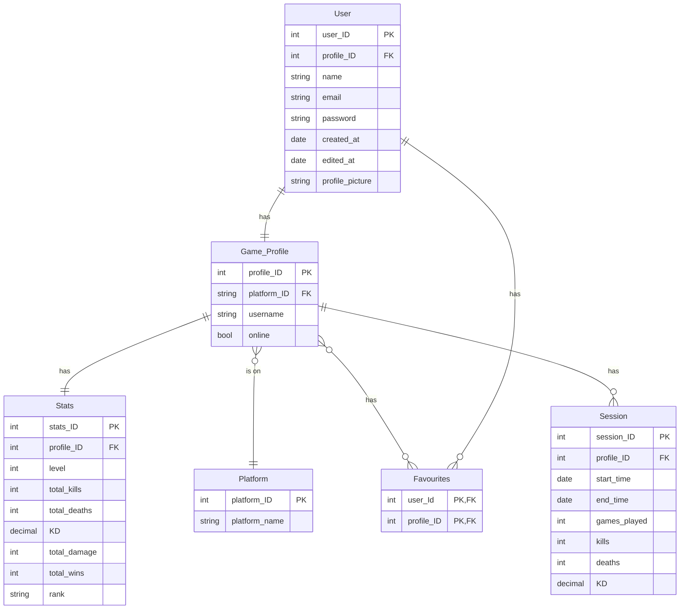
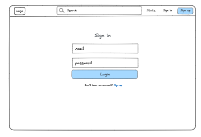
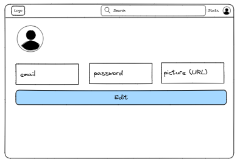
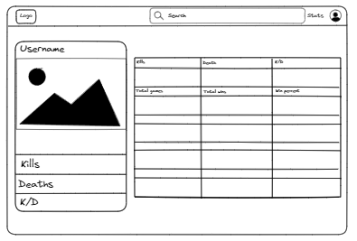

Welcome to **Project Brainrot** – a simple, yet effective and detailed news, statistics, and content tracker for the massively multiplayer online battle royale "Apex Legends". This app is targeted towards the 18 **million** monthly active players, offering:

-   A detailed platform profile lookup and statistics dashboard.
-   Current map rotations, store offerings, and news updates.
-   Accurate and up to date profile stats, with the ability to link platform accounts for fast stats lookup, and favourited profiles.

Despite the several existing stats trackers, dahsboards and profile lookups, many of them offer convoluted search processes, inaccurate data and low functionality. 

## 🧱 Core Functionality

-   **Profile Lookup:** Users can search for any user by specifying platform and platofrm user name.
-   **Account Linking:** Users can link their game platform account to the site account to get quick and easy statistics.
-   **Profile Favouriting:** Users can opt to favourite frequently looked up profiles, either friends or enemies, for fast and easy profile lookups.
-   **Up-To-Date News:** A dedicated page displaying store contents and offerings, as well as map rotations and in game news.
-   **Session Stats:** Stats broken up by session for easy tracking of player progression through across multiple sessions.

### Requirements

#### Profile Lookup

-   As a user, I want to be able to specify a profiles platform to simplify lookups.
-   As a user, I want to be able to specify a user's platform username so I can find exactly who I am looking for.

#### Favourites Stories

-   As a user, I want to favourite a profile that I frequently visit to acces my own and my friends' stats easier.
-   As a user, I want to be able to easily and intuitively access my favourited profiles.

#### User Management Stories

-   As a user, I want to register for an account so I can start using the app.
-   As a user, I want to log in to my account to access my stats and favourites.
-   As a user, I want to log out of my account to securely end my session.
-   As a user, I want to link my game platform account to facilitate the retrieval of my stats.

#### News/Updates Stories

-   As a user, I want to be able to intuitively access and see upcoming map rotations.
-   As a user, I want to be able to easily access store offerings relative to me.
-   As a user, I want to be able to stay up to date and see currently unfolding game news.

## ᛦ Entity Relationships

-   **Authentication System:** Handling user registration, login, logout, and session management.
-   **Profile Management:** Logic for profile lookups, stats retrieval, and CRUD operations on stats and users.
-   **Favouriting Management:** Logic for profile favouriting and retrieval, assignment, updates, filtering, and notifications.
-   **UI Elements:** Design of forms, stats displays, project overview, favouriting list.

## 📍 API Routes

### User Management

| Request              | Action                           | Response              | Description                                                             |
| -------------------- | -------------------------------- | --------------------- | ----------------------------------------------------------------------- |
| GET /register       | AuthController::getRegistrationForm | 200 RegistrationForm | Render the registration form |
| GET /login    | AuthController::getLoginForm | 200 LoginForm | Render the login form |
| POST /login    | AuthController::login | 200 /search | Logs a user in and redirects to search page |
| POST /login    | AuthController::login | 400 /search | Badrequest if user inputs invalid information |
| GET /logout | AuthController::logout | 200 LoginForm | Log out and redirect to login page |
| POST /user | UserController::createUser | 201 /login | Creates the user and redirects to the login page |
| POST /user | UserController::createUser | 400 /register | Badrequest if the user inputs invalid information |
| GET /user/edit | UserController::getUserPage | 200 EditProfileView | Renders the profile page |
| PUT /user/edit | UserController::updateUser | 200 /user/edit | Updates the users profile |
| PUT /user/edit | UserController::updateUser | 400 /user/edit | Badrequest if user inputs invalid information |

### Search and Stats Retrieval

| Request                                   | Action                     | Response                 | Description                        |
| ----------------------------------------- | -------------------------- | ------------------------ | ---------------------------------- |
| GET /stats/:username    | StatsController::getStatisticsPage    | 200 StatView       | Render the statistic page |
| POST /search | SearchController::findPlayerStatistics | 200  /stats/:username | Retrieve a specific players in game statistics |
| POST /search | SearchController::findPlayerStatistics | 404  /search | Not found if the player's username doesn't exist |
| GET /search | SearchController::getSearchForm | 200 SearchForm | Render the registration form | 

## 📐 Wireframes

The login view is the initial screen where users can enter their credentials to log into their account. It consists of a form with input fields for the email and password, along with a "Login" button. The login view also includes a link to the registration page for new users who don't have an account yet.

The register view is the screen where users can enter in credentials to create an account on our site. It consists of email and password, along with a link to the login page for existing users.

The user profile shows the user's profile picture if set, and gives them a place where they can update their email, password and profile picture. 

The serach view allows the user to find a player's statistics by searching for them in our database. This consists of a form with input fields for the username and the platform that user can be found on.

This view shows the user more details for their found player. It will give them all relevent statistics they would need. Such as the accounts total kills, deaths, damage, wins along with their kill to death ratio, player level, rank and if they player is currently online.
