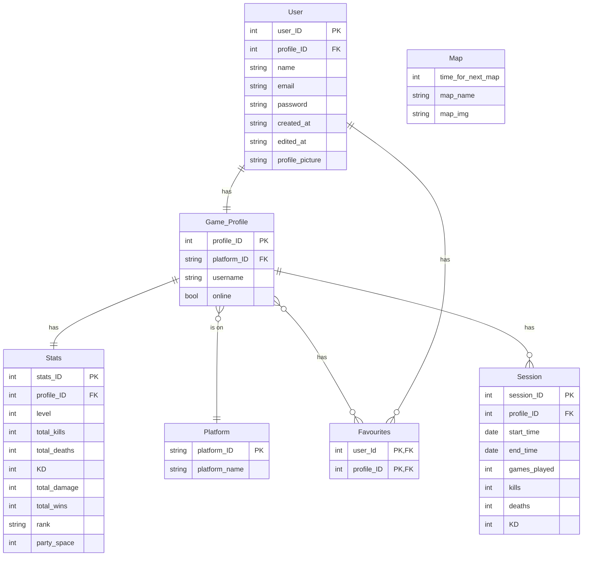

Your [project](https://vikramsinghmtl.github.io/420-4W6-Web-Programming-II/project/specifications) proposal will go here. Since you have to write your proposal in markdown, I've provided the sample proposal below so you have a reference for the syntax. Don't worry about getting rid of my stuff below since there's the live [sample proposal](https://vikramsinghmtl.github.io/420-4W6-Web-Programming-II/project/example-proposal) copy on the notes website.

---

Welcome to **Project Brainrot** – a simple, yet effective and detailed news, statistics, and content tracker for the massively multiplayer online battle royale "Apex Legends". This app is targeted towards the 18 **million** monthly active players, offering:

-   A detailed platform profile lookup and statistics dashboard.
-   Current map rotations, store offerings, and news updates.
-   Accurate and up to date profile stats, with the ability to link platform accounts for fast stats lookup, and favourited profiles.

Despite the several existing stats trackers, dahsboards and profile lookups, many of them offer convoluted search processes, inaccurate data and low functionality. 

## 🧱 Core Functionality

-   **Profile Lookup:** Users can search for any user by specifying platform and platofrm user name.
-   **Account Linking:** Users can link their game platform account to the site account to get quick and easy statistics.
-   **Profile Favouriting:** Users can opt to favourite frequently looked up profiles, either friends or enemies, for fast and easy profile lookups.
-   **Up-To-Date News:** A dedicated page displaying store contents and offerings, as well as map rotations and in game news.
-   **Session Stats:** Stats broken up by session for easy tracking of player progression through across multiple sessions.

### Requirements

#### Profile Lookup

-   As a user, I want to be able to specify a profiles platform to simplify lookups.
-   As a user, I want to be able to specify a user's platform username so I can find exactly who I am looking for.

#### Favourites Stories

-   As a user, I want to favourite a profile that I frequently visit to acces my own and my friends' stats easier.
-   As a user, I want to be able to easily and intuitively access my favourited profiles.

#### User Management Stories

-   As a user, I want to register for an account so I can start using the app.
-   As a user, I want to log in to my account to access my stats and favourites.
-   As a user, I want to log out of my account to securely end my session.
-   As a user, I want to link my game platform account to facilitate the retrieval of my stats.

#### News/Updates Stories

-   As a user, I want to be able to intuitively access and see upcoming map rotations.
-   As a user, I want to be able to easily access store offerings relative to me.
-   As a user, I want to be able to stay up to date and see currently unfolding game news.

## ᛦ Entity Relationships

-   **Authentication System:** Handling user registration, login, logout, and session management.
-   **Profile Management:** Logic for profile lookups, stats retrieval, and CRUD operations on stats and users.
-   **Favouriting Management:** Logic for profile favouriting and retrieval, assignment, updates, filtering, and notifications.
-   **UI Elements:** Design of forms, stats displays, project overview, favouriting list.

## 📍 API Routes

### User Management

| Request              | Action                           | Response              | Description                                                             |
| -------------------- | -------------------------------- | --------------------- | ----------------------------------------------------------------------- |
| GET /register       | AuthController::getRegistrationForm | 201 /login     | Create a new user and redirect to the login page                |
| GET /login    | AuthController::getLoginForm    | 200 LoginForm | Render the login form                                  |
| POST /login    | AuthController::login | 200 Search | Logs a user in and authenticates and redirects to search page                                |
| GET /logout | AuthController::logout | 200 Login      | Log out and redirect to login page |

### Task Management

| Request                                   | Action                     | Response                 | Description                        |
| ----------------------------------------- | -------------------------- | ------------------------ | ---------------------------------- |
| POST /projects/:projectId/tasks           | TaskController::createTask | 201 /projects/:projectId | Create a new task within a project |
| GET /projects/:projectId/tasks/:taskId    | TaskController::getTask    | 200 TaskDetailView       | Retrieve a specific task's details |
| PUT /projects/:projectId/tasks/:taskId    | TaskController::updateTask | 200 TaskDetailView       | Edit an existing task              |
| DELETE /projects/:projectId/tasks/:taskId | TaskController::deleteTask | 204 (No Content)         | Delete a task                      |

## 📐 Wireframes

>[!note]
> Don't go crazy detailed with the wireframes! These should be minimal sketches to convey to the customer what the app will roughly look like. These things tend to change over time as requirements evolve, but you need to start from somewhere.

The login view is the initial screen where users can enter their credentials to log into their account. It typically consists of a form with input fields for the username/email and password, along with a "Login" button. The login view should also include a link to the registration page for new users who don't have an account yet.

All the tasks for the logged in user where they can sort by title, due date, and created date. They can also filter tasks to only see completed or uncompleted tasks. The user can check off tasks here, or if they want a more detailed view, can click on one of the tasks (see next view).

This view shows the user more details for one specific task. If a due date was set, it will tell them how many days from now the task is due. There is a description field to provide more context for the task, as well as task actions to mark the task as complete, edit the task, or delete. On the right we have a sub-task list so that the user can breakdown the task steps even further. The sub-tasks can be checked off when completed.

The user profile shows the user's profile picture if set, and gives them a place where they can update their email and password. Here is also where they can control if the site is displayed in light or dark mode depending on the value of the toggle switch.
